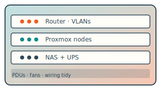
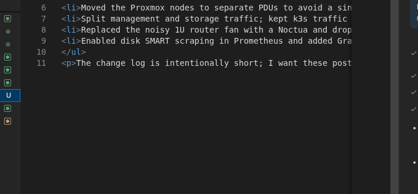

# Homelab refresh notes

Quick checkpoint on rearranging the small rack at home. Nothing fancy — just wiring and monitoring tweaks.



Some context:

- Moved the Proxmox nodes to separate PDUs to avoid a single power bar failure.
- Split management and storage traffic; kept k3s traffic on VLAN 30.
- Replaced the noisy 1U router fan with a Noctua and dropped temps by ~6°C.
- Enabled disk SMART scraping in Prometheus and added Grafana alerts for pre-fail attributes.

The change log is intentionally short; I want these posts to stay readable on a phone.

```python

import datetime
import jinja2
import pathlib
import markdown


root_dir = pathlib.Path(__file__).resolve().parent
src = root_dir / "src"
site = src / "site"
out = root_dir / "out"


def convert_markdown_to_html_in_place(p: pathlib.Path) -> None:
    if p.is_file() and p.name.endswith(".md"):
        content = p.read_text()

        md_out_file = p.with_suffix(".html")
        md_content = markdown.markdown(content)

        if md_out_file.exists() and md_out_file.read_text() == md_content:
            return

        md_out_file.write_text(md_content)

    elif p.is_dir():
        for nested_path in p.iterdir():
            convert_markdown_to_html_in_place(nested_path)
        return


def process_path(p: pathlib.Path, context: dict) -> None:
    rel_src = p.relative_to(src)
    rel_site = p.relative_to(site)

    out_file = out / rel_site
    out_file.parent.mkdir(parents=True, exist_ok=True)

    if p.is_file() and p.name.endswith(".html"):
        content = environment.get_template(str(rel_src)).render(context)
    elif p.is_dir():
        for nested_path in p.iterdir():
            process_path(nested_path, context)
        return
    else:
        content = p.read_bytes()
        out_file.write_bytes(content)
        return

    out_file.write_text(content)


if __name__ == "__main__":
    out.mkdir(exist_ok=True)

    environment = jinja2.Environment(loader=jinja2.FileSystemLoader(src))

    for path in (site / "_data").iterdir():
        convert_markdown_to_html_in_place(path)

    convert_markdown_to_html_in_place(site / "blog")

    context = {"build_timestamp": int(datetime.datetime.now(datetime.UTC).timestamp())}

    for path in site.iterdir():
        process_path(path, context)

```