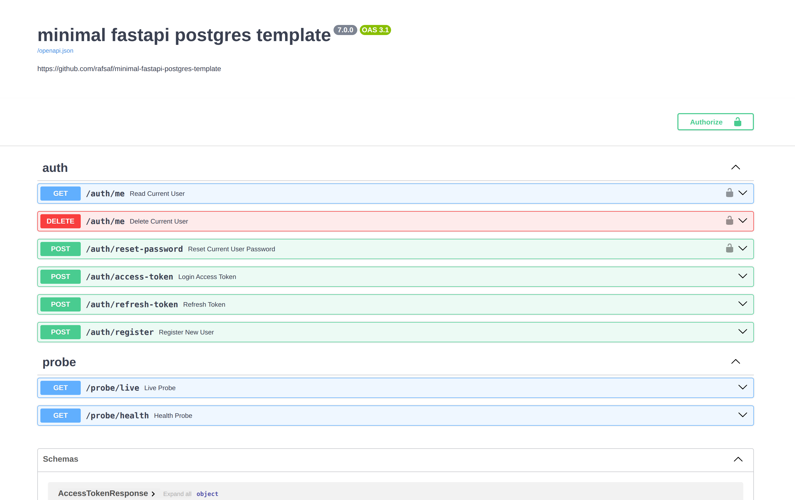
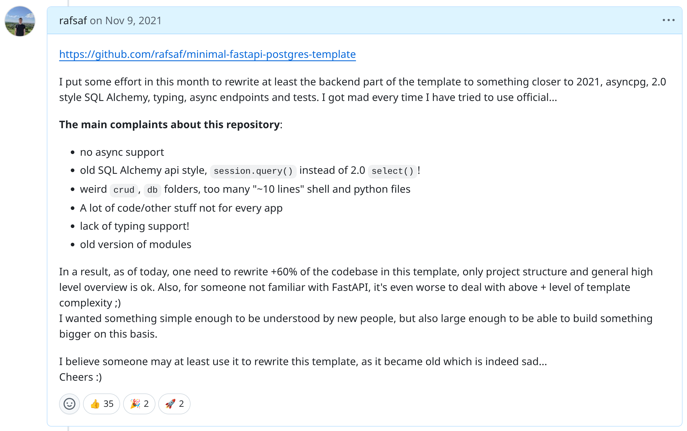

# Update of minimal-fastapi-postgres-template to version 7.0.0

This article describes the breaking changes and the rationale for this year's update for Open Source project [minimal-fastapi-postgres-template](https://github.com/rafsaf/minimal-fastapi-postgres-template).



## Brief history and attiude

I started with [minimal-fastapi-postgres-template](https://github.com/rafsaf/minimal-fastapi-postgres-template) in [Sep 21, 2021](https://github.com/rafsaf/minimal-fastapi-postgres-template/commit/79f56b6eac8c01fc80de2d109eb2a377d177642a) forked from [official fastapi template](https://github.com/fastapi/full-stack-fastapi-template) and introduced it in [this comment in \#422 issue](https://github.com/fastapi/full-stack-fastapi-template/issues/422#issuecomment-964508158).



From there, I tend to update it **yearly**, usually at the end of the year (after new Python version release), or if I was busy, sometimes early next year. Template software like this evolve very fast, almost each year there were very significant breaking changes, including "emotional", "opinionated" decisions that is also strong factor.

In other words, what I mean by that, that I don't need to keep any backward compability, no files must stay unchaged, no conventions are there forever, if I see something better in the wild, I just backport it (or not) next year, simple.

But – **Please!!!** – don't think I am the person that love new tech poping up each month and I start each new project with new technology (new JS framework was created 67 days ago according to [dayssincelastjsframework.com](https://dayssincelastjsframework.com/)). In fact, I'm somewhere in between (maybe a bit towards Greybeards). I use Django without calling it legacy, I think 3x times before adapting new tech, I don't fall easly into excitation where things like [SQLModel](https://github.com/fastapi/sqlmodel) pop up (I've seen teams that falled into this trap, feel sorry if you too), same as I don't trust new InfluxDB being faster 30000x than any other thing, because it's written in Rust so it can breake laws of physics. Right. But sometimes, still, I see value in new things.

## Release 7.0.0

### 1. Migration from Poetry into uv

I used [poetry](https://python-poetry.org/) for many years. But version 2 and afterwards ended my ocean of patience for them. Disapearing venvs, broken management, constant changes in underlying behaviour causing you to frequently just delete managed venvs manually and recreate them. Python installation management (new feature) also only sometimes working. I tend to use it with [pyenv](https://github.com/pyenv/pyenv) and in recent versions that I was just inforious with all kind of problems simply feeling like wasting my time.

On the contrary, with [uv](https://docs.astral.sh/uv/) **it just works** which is indeed great improvement, doesn't it? `uv sync` and voila, if something is broken then venv is recreated. Two things why I was NOT eager to use it: 10-100x faster, I don't like this kind of "marketing", using disk and pretending to be somehow faster (most of time pip, poetry or uv **download** stuff from PyPI... so it improves 10-100x my internet bandwith, right?, how neat) is not attractive for me. Second reason is [docker integration](https://docs.astral.sh/uv/guides/integration/docker/). I am extra careful when someone's **first, recommended** way of using package manager is to use their own image... I don't need or want any package manager in my end image except pip, nor should anybody. Those are steps to create some kind of bias and to "have impact", just a guess as I don't understand motivations fully. Anyway you can have separate layer to export requirements.txt and just use pip, so no harm done.

```dockerfile
FROM base AS uv
COPY --from=ghcr.io/astral-sh/uv:0.9.2 /uv /uvx /bin/
COPY uv.lock pyproject.toml ./
RUN uv export --no-dev --no-hashes -o /requirements.txt --no-install-workspace --frozen
RUN uv export --only-group dev --no-hashes -o /requirements-dev.txt --no-install-workspace --frozen

FROM base AS final
COPY --from=uv /requirements.txt .
```

### 2. Bump all software

Obviously.

### 3. New "modules" design

My team at Opera created the project based on that exact template which helped me understand some fundamental flaws in current shape.

Before:

```bash
app/
├── __init__.py
├── main.py
├── models.py
├── api/
│   ├── __init__.py
│   ├── api_messages.py
│   ├── api_router.py
│   ├── deps.py
│   └── endpoints/
│       ├── __init__.py
│       ├── auth.py
│       └── users.py
├── auth/
│   └── tests/
├── core/
│   ├── __init__.py
│   ├── config.py
│   ├── database_session.py
│   └── security/
│       ├── __init__.py
│       ├── jwt.py
│       └── password.py
├── probe/
│   └── tests/
├── schemas/
│   ├── __init__.py
│   ├── requests.py
│   └── responses.py
└── tests/
    ├── __init__.py
    ├── conftest.py
    ├── test_api_router_jwt_errors.py
    ├── test_auth/
    │   ├── __init__.py
    │   ├── test_access_token.py
    │   ├── test_auth_refresh_token.py
    │   └── test_register_new_user.py
    ├── test_core/
    │   ├── __init__.py
    │   ├── test_jwt.py
    │   └── test_password.py
    └── test_users/
        ├── __init__.py
        ├── test_delete_current_user.py
        ├── test_read_current_user.py
        └── test_reset_password.py
```

After:

```bash
app/
├── __init__.py
├── conftest.py
├── main.py
├── auth/
│   ├── __init__.py
│   ├── api_messages.py
│   ├── dependencies.py
│   ├── jwt.py
│   ├── models.py
│   ├── password.py
│   ├── responses.py
│   ├── schemas.py
│   ├── views.py
│   └── tests/
│       ├── __init__.py
│       ├── test_jwt.py
│       ├── test_password.py
│       ├── test_view_delete_current_user.py
│       ├── test_view_login_access_token.py
│       ├── test_view_read_current_user.py
│       ├── test_view_refresh_token.py
│       ├── test_view_register_new_user.py
│       └── test_view_reset_current_user_password.py
├── core/
│   ├── __init__.py
│   ├── config.py
│   ├── database_session.py
│   ├── lifespan.py
│   ├── metrics.py
│   └── models.py
├── probe/
│   ├── __init__.py
│   ├── views.py
│   └── tests/
│       ├── __init__.py
│       └── test_views.py
└── tests/
    ├── auth.py
    └── factories.py
```

Indeed, modules are much more scalable. I don't think this need further explanation to be honest.

### 4. Prometheus exporter

I feel in 2026 **not** using Prometheus is something not very common. Yes, it says "minimal" template, but there are not a lot of cases where you don't need some monitoring. Clever way to start it is as a new thread in lifecycle hook of fastapi app itself.

```python
@asynccontextmanager
async def lifespan(_: FastAPI) -> AsyncGenerator[None]:  # pragma: no cover
    logger.info("starting application...")
    if get_settings().prometheus.enabled:
        logger.info(
            "starting prometheus client server on interface %s port %d",
            get_settings().prometheus.addr,
            get_settings().prometheus.port,
        )

        prometheus_client.start_http_server(
            addr=get_settings().prometheus.addr,
            port=get_settings().prometheus.port,
        )
        metrics.APP_STARTED.inc()

    yield

    logger.info("shutting down application...")

    await database_session._ASYNC_ENGINE.dispose()
    logger.info("disposed database engine and closed connections...")

    if get_settings().prometheus.enabled:
        logger.info(
            "stopping prometheus with delay of %d seconds...",
            get_settings().prometheus.stop_delay_secs,
        )
        metrics.APP_STOPPED.inc()
        await asyncio.sleep(get_settings().prometheus.stop_delay_secs)

    logger.info("bye! application shutdown completed")
```

But then someone may ask – wait, what if there are multiple processes of FastAPI app in one container? Well – in async Python world we have one loop per process anyway so it actually make no sense **if it's simpler**(and it is) to have more than one "process", "worker" in single container. If in docker, just use multiple instances, if in kubernetes, spawn more pods, no need to complicate prometheus setup at all (and there is no fun at all to play with it, belive me, `PROMETHEUS_MULTIPROC_DIR` is closer to hack than solution).

```dockerfile
# Set CMD to uvicorn
# /venv/bin/uvicorn is used because from entrypoint script PATH is new
CMD ["/venv/bin/uvicorn", "app.main:app", "--host", "0.0.0.0", "--port", "8000", "--workers", "1", "--loop", "uvloop"]
```

### 5. polyfactory and faker

Last year I learned how convinient and scalable is to use factories for DB models (than hand crafted creating each test).

```python
class UserFactory(SQLAlchemyFactory[User]):
    email = Use(Faker().email)
    hashed_password = Use(lambda: get_password_hash(TESTS_USER_PASSWORD))

# and then in tests...
new_user = UserFactory.create_async()
```

Price? Even more confusing `conftest.py` and `fixture_session_with_rollback` fixture. At this point it is probably hardly readable by async newcomers, but it is as it is.

### 6. Alembic upgrade in tests

Usually (that was also the case for this template for years of course) in tests people from SQLAlchemy world just use current tables without thinking about using their own migration.

```python
# create app tables in test database
async with engine.begin() as conn:
    await conn.run_sync(Base.metadata.create_all)
```

But – old good Django has different default behaviour and it is for reason – that is to apply all migrations. It can save your time later avoiding flawed migration to detonate your database, so new code in `conftest.py` on fresh database bootsrap for tests is following:

```python
def alembic_upgrade() -> None:
    # synchronous function to run alembic upgrade
    alembic_config = alembic.config.Config(PROJECT_DIR / "alembic.ini")
    alembic.command.upgrade(alembic_config, "head")

loop = asyncio.get_running_loop()
await loop.run_in_executor(None, alembic_upgrade)
```

### 7. Makefile

Yes, I know most people will probably delete it, but I use it and I like it so I put it here, remembering commands longer than few words after working in 100 different projects in few companies is challenging enough to appreciate if they is shortcut

```bash
$ make help
grep -E '^[\.a-zA-Z_-]+:.*?## .*$' Makefile | sort | awk 'BEGIN {FS = ":.*?## "}; {printf "\033[36m%-30s\033[0m %s\n", $1, $2}'
down                           Stop database
.env                           Ensure there is env file or create one
help                           Print this help message
lint                           Run all linters
local-setup                    Setup local postgres database
run                            Alias for `up`
test                           Run unit tests
up                             Run FastAPI development server
```

### Summary

I am writting all of this in that long format, because it may be interesting at least for some people and it does not fit into README section. Thank you!

---

Last updated: 2026-02-08

Content license: CC BY-NC 4.0 — share and adapt with attribution, no commercial use.
